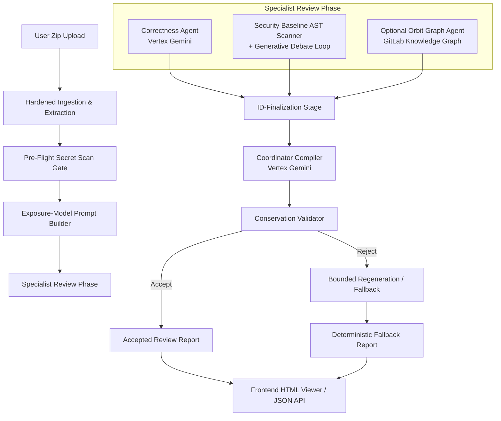

# GDG-YorkU Automated Multi-Agent Code Review System

GDG-YorkU Code Review is a production-grade, multi-agent automated code-review system developed for the Google × GDG-on-Campus-York case competition. It accepts a `.zip` repository upload and returns a structured, actionable, and fully-accounted review report.

---

## 🎯 The Problem We Targeted

Automating repository-level code reviews with LLMs faces three primary challenges in real-world environments:
1. **Trust Boundary Breakouts & Prompt Injection**: Untrusted codebase files (e.g., a malicious `SPEC.md`) can escape delimiters and hijack LLM instructions.
2. **Secret Propagation & Leakage**: Hardcoded API keys, passwords, or credentials can easily slip into LLM prompts, audit logs, error traces, or web payloads.
3. **Coordinator Hallucination & Omission**: Specialist review perspectives often conflict, duplicate, or get omitted during coordination. Standard LLMs easily lose or silently drop critical vulnerabilities under high cognitive loads.
4. **Reliability & Service Uptime**: Heavy reliance on generative AI makes the entire system prone to API rate limits, transient network failures, and token limits, resulting in failed runs.

Our system resolves these challenges by combining **deterministic AST-based security gates**, a **multi-agent debate framework**, **grounded knowledge graphs**, and a **failsafe validator loop** that guarantees 100% service availability.

---

## 🚀 Google Technology Used & Why

* **Vertex AI Gemini (Gemini 1.5 Flash / Pro)**:
  * *Why*: Used to run the grounded Correctness Agent, the Security Defender, and the Coordinator Compiler. Gemini's massive context window enables ingestion of entire codebase contexts, while its rapid inference speed keeps review latency low. Its robust **JSON-schema locking** ensures structured, schema-valid outputs that can be deterministically parsed and verified by our system.
* **Google ADK (Agent Development Kit)**:
  * *Why*: Used as the core framework for multi-agent execution and orchestration. The `AdkOrchestrator` genuinely runs on the Google ADK framework, backing session state on ADK's `InMemorySessionService` and orchestrating Vertex Gemini calls via ADK's `LlmAgent` and `Runner` execution loop. To mitigate dependency and environment risks, it is wrapped behind a robust **Orchestration Seam** that degrades gracefully to a pure-Python `InProcessOrchestrator` if ADK is unavailable or fails at runtime.

---

## 📊 Where We Are At (Current Project Status)

* **Sprint 5 Complete**: We have fully implemented, tested, and verified all core and optional upgrades.
* **Optional Upgrades Implemented**:
  1. **Generative Security Debate Loop**: Gemini Defender vs. Claude Challenger adversarial debate with delta score convergence stop-conditions.
  2. **Orbit Blast-Radius Specialist**: Integrates with GitLab Knowledge Graph queries to evaluate the impact of changing functions or variables, complete with fail-safes.
* **Test Posture**: The system passes **369 tests** (100% pass rate) spanning parser edge cases, secret scanning, coordinate-join mappings, and E2E review uploads. We are currently preparing for final E2E verification and video recording.

---

## 🏗️ Architecture & System Flow



### 1. Ingestion & Hardened Extraction
Accepts a `.zip` archive upload under strict resource limits (aggregate compressed/uncompressed size, file count, and per-file limits). Traversal entries, absolute paths, and symlinks are safely skipped rather than aborting the pipeline.

### 2. Decoupled Secret & Ingestion Scopes
* **Pre-flight Secret Scan Scope**: Scans the *entire* extracted corpus (including gitignored files like `.env` and configuration files). Detected secrets are cataloged and system-wide redacted.
* **LLM Prompt Scope**: Restriced to `prompt_exposed` files only (system excludes like `.venv` or binaries, and files matched by root `.gitignore` are excluded from LLM prompts to protect token bandwidth and privacy).

### 3. Specialist Reviewers
* **Correctness Agent**: Compares implementation code against discovered Source-of-Truth documentation (e.g. `SPEC.md` or README files matching a heading allowlist) using random-nonced evidence plane delimiters.
* **Security & Assurance**: Runs a high-precision deterministic AST baseline scanner (SQLi, `shell=True`, unsafe deserialization, missing authorization, path traversal, verify=False). If enabled, it upgrades to a Gemini vs Claude adversarial debate loop seeded by AST findings.
* **Orbit Blast-Radius Agent**: Leverages GitLab's Orbit Graph API to query code definitions, imports, and calls, mapping the blast radius of downstream dependencies.

### 4. ID Finalization & Coordination
Provisional findings are assigned deterministic, collision-safe IDs using non-prose anchors and occurrence ordinals. The coordinator compiles the findings, which are then passed to the Validator.

### 5. Conservation Validator & Terminal Fallback
Strictly verifies that no critical or high findings were dropped or downgraded, and checks that all coordinate citations exist. If compilation fails, the system regenerates or falls back to a **deterministic terminal report** containing every input finding verbatim, requiring zero LLM tokens and guaranteeing uptime.

---

## 🛠️ Key Design Decisions

1. **Deterministic Baseline First**: The AST baseline scanner always runs first, guaranteeing a complete security report even if LLM debate APIs fail or are unconfigured.
2. **Exposure-Aware Secret Severity**: Promotes prompt-exposed secrets to `high`/`critical` review findings, while keeping gitignored secrets at `info` (advisory) levels.
3. **No-Spec Capping**: Correctness findings on repos lacking specification documents are capped at `medium` to avoid LLM hallucinations.
4. **Debate LEDGER Integrity**: Defeated high/critical debate proposals are promoted to `contested` status, ensuring they remain visible in the ledger instead of being silently dropped.
5. **Severity Floor**: Canonical mapping reconciles blocker/major/minor to critical/high/medium/low. The reporting floor is locked at `high` for active lists, ensuring developer focus.

---

## 🔄 Example Workflow

1. **Upload**: A developer uploads a project zip containing `src/app.py` and a gitignored `.env` containing a database credential.
2. **Secret Detection**: The Pre-flight Secret Gate flags the credential in `.env`. Since the file is gitignored, it is kept out of LLM prompts, and the secret value is replaced system-wide with a salted hash fingerprint (`[REDACTED_API_KEY]`).
3. **Correctness Review**: The Correctness Agent extracts constraints from `SPEC.md` and flags that `src/app.py` lacks input length bounds. It cites `SPEC.md#L45-L48` as evidence.
4. **Security Scan**: The AST baseline flags an unauthenticated POST route. Since debate is enabled, the Gemini Defender and Claude Challenger debate its exploitability. The Defender argues it is internal, but since the finding is above the floor, it is retained as `contested` in the ledger.
5. **Blast Radius Analysis**: The Orbit agent flags that modifying `src/app.py:db_connect` impacts 12 downstream functions across 3 files.
6. **Validation**: The coordinator compiles these findings. The validator confirms every finding maps to valid file lines, accounts for every input, and outputs the final HTML report showing the review and ledger.

---

## 📏 Commit Window Guard
* **Window Invariant**: Checked automatically by `scripts/check_commit_window.py`. Enforces that all git author and commit dates are $\ge$ **2026-06-17**.

---

## 🔍 Supported AST Security Rules

The baseline AST scanner implements 6 rules:
1. **SQLi**: DB execution calls receiving non-literal queries built via f-strings, concatenation, or format calls.
2. **Command Injection**: Subprocess/os calls with `shell=True` and non-literal command strings.
3. **Unsafe Deserialization**: Calls to `pickle.load`/`loads` or `yaml.load` on non-literal data (without `SafeLoader`).
4. **Missing Auth**: FastAPI/Flask write routes (POST, PUT, PATCH, DELETE) lacking authorization decorators or dependency injections.
5. **Path Traversal**: Using untrusted input in file `open` or path joins without a validation/normalization check.
6. **Disabled SSL Verification**: HTTP calls containing `verify=False` literals.

---

## 💻 Quick Start & Setup

### 1. Installation
Clone the repository and set up a virtual environment:
```bash
cd gdg-yorku-submission
python -m venv .venv
source .venv/Scripts/activate  # On Windows: .venv\Scripts\activate
pip install -e ".[dev]"
```

### 2. Configuration
Create a `.env` file in the root directory (refer to `.env.example`):
```env
GEMINI_API_KEY=your-gemini-key
ANTHROPIC_API_KEY=your-claude-key
ORBIT_API_URL=https://gitlab.com/api/v4/orbit
ORBIT_API_TOKEN=your-gitlab-token
ORBIT_PROJECT_PATH=your-username/your-repo
USE_FAKE_LLM=true  # Set to false to run actual LLM integrations
ENABLE_SECURITY_DEBATE=true
```

### 3. Running Tests
To execute the unit and integration tests:
```bash
pytest
```

### 4. Verification Check
To run the commit window validation script:
```bash
python scripts/check_commit_window.py
```
